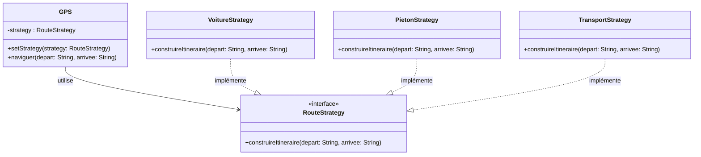

# Comprendre le Design Pattern Strategy : L'analogie du GPS

En programmation, nous sommes souvent confrontés à un dilemme : comment gérer un code qui doit effectuer une même tâche de plusieurs manières différentes, sans finir avec des structures conditionnelles interminables ?

Pour répondre à cette problématique, il existe une solution élégante issue des principes **SOLID** : le **Patron Stratégie (Strategy Pattern)**.

Dans cet article, nous allons comprendre ce concept à travers une analogie que nous utilisons tous les jours : une application de GPS.

## 1. Le Problème : Le piège des `if / else`

Imaginez que vous développez le cœur d'une application de navigation. Votre mission est simple : calculer un itinéraire d'un point A à un point B.

Au début, l'application ne gère que les **voitures**. Votre code est simple. Mais très vite, on vous demande d'ajouter les itinéraires **piétons**, puis les **transports en commun**.

L'approche naïve consiste à tout gérer dans la classe principale `GPS` avec une grosse structure conditionnelle :

```java
// Ce qu'il faut éviter
public class GPS {
    public void naviguer(String type, String A, String B) {
        if (type.equals("VOITURE")) {
            // ... 50 lignes de code complexe pour la route voiture
        } else if (type.equals("PIETON")) {
            // ... 40 lignes de code pour les sentiers
        } else if (type.equals("TRANSPORT")) {
            // ... 60 lignes pour les bus/métros
        }
    }
}

```

### Pourquoi est-ce dangereux ?

Ce code viole le **Principe Ouvert/Fermé (Open/Closed Principle)**.
Si demain vous voulez ajouter une option "Vélo" :

1. Vous devez **modifier** la classe `GPS`.
2. Vous risquez de casser le code existant (introduire des bugs dans la partie "Voiture").
3. La classe `GPS` devient énorme et difficile à maintenir.

## 2. La solution : Le Patron Stratégie

Le pattern Strategy suggère une approche différente : **"Défini une famille d'algorithmes, encapsule chacun d'eux, et rend-les interchangeables."**

Au lieu que le GPS sache *comment* calculer la route, il va déléguer cette tâche à des spécialistes (les stratégies).

### L'architecture en 3 parties :

1. **L'Interface (le contrat) :** Elle définit ce que toutes les stratégies doivent savoir faire (ici : `construireItineraire`).
2. **Les stratégies concrètes :** Chaque mode de transport (Voiture, Piéton, Bus) a sa propre classe.
3. **Le contexte (le GPS) :** Il possède une référence vers une stratégie et l'utilise sans connaître les détails techniques.



## 3. Implémentation en Java

Voyons comment transformer notre code "spaghetti" en une architecture propre.

### Étape A : L'interface commune

Tout d'abord, nous créons un contrat que tous nos modes de transport devront respecter.

```java
public interface RouteStrategy {
    void construireItineraire(String pointDepart, String pointArrivee);
}

```

### Étape B : Les stratégies concrètes

Nous isolons chaque algorithme dans sa propre classe.

```java
// Stratégie pour les voitures
public class VoitureStrategy implements RouteStrategy {
    public void construireItineraire(String a, String b) {
        System.out.println("Itinéraire voiture " + a + " -> " + b + " via autoroutes.");
    }
}

// Stratégie pour les piétons
public class PietonStrategy implements RouteStrategy {
    public void construireItineraire(String a, String b) {
        System.out.println("Itinéraire piéton " + a + " -> " + b + " via les parcs.");
    }
}

// Stratégie pour les transports
public class TransportStrategy implements RouteStrategy {
    public void construireItineraire(String a, String b) {
        System.out.println("Itinéraire transport en commun " + a + " -> " + b + " via le bus/métro.");
    }
}

```

### Étape C : Le Contexte (Le GPS)

Voici la classe principale. Remarquez qu'elle ne contient **aucun** `if` ou `else` concernant le type de transport. Elle est "propre".

```java
public class GPS {
    private RouteStrategy strategy;

    // On peut changer de stratégie dynamiquement (le fameux "Runtime")
    public void setStrategy(RouteStrategy strategy) {
        this.strategy = strategy;
    }

    public void naviguer(String depart, String arrivee) {
        if(strategy == null) {
            System.out.println("Veuillez choisir un mode de transport.");
            return;
        }
        // Le GPS délègue le travail à la stratégie actuelle
        strategy.construireItineraire(depart, arrivee);
    }
}

```

## 4. Utilisation finale

C'est ici que la magie opère. L'utilisateur peut changer de mode de transport à la volée, sans qu'on ait besoin de redémarrer l'application ou de recompiler la classe GPS.

```java
public class App {
    public static void main(String[] args) {
        GPS monGPS = new GPS();
        
        // 1. Mode Voiture
        monGPS.setStrategy(new VoitureStrategy());
        monGPS.naviguer("Paris", "Lyon");
        
        // L'utilisateur change d'avis...
        
        // 2. Mode Piéton (Changement dynamique)
        monGPS.setStrategy(new PietonStrategy());
        monGPS.naviguer("Gare de Lyon", "Hôtel");
    }
}

```

## Conclusion

Le Patron Stratégie nous a permis de rendre notre application de GPS :

* **Extensible :** Vous voulez ajouter le mode "Vélo" ? Créez simplement une classe `VeloStrategy`. Vous n'avez même pas besoin d'ouvrir le fichier `GPS.java`.
* **Maintenable :** Chaque algorithme est isolé. Un bug dans le mode Piéton n'affectera jamais le mode Voiture.
* **Lisible :** Nous avons éliminé les blocs conditionnels complexes.

La prochaine fois que vous voyez un `switch` ou une série de `if/else` qui sélectionne un comportement, demandez-vous : *"Ne devrais-je pas utiliser une stratégie ici ?"*
